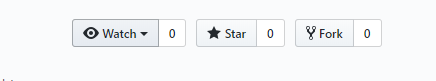
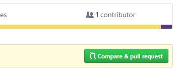
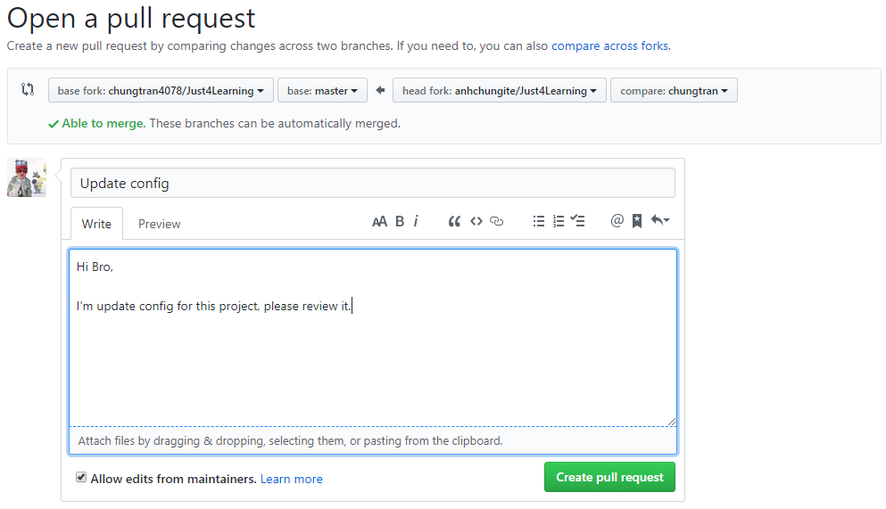

Việc đóng góp code cho một dự án trên Github còn gọi được gọi là __Contribution__

__1. Fork dự án cần đóng góp code__



Sau khi fork, trong danh sách repositories của mình sẽ xuất hiện repo vừa fork.

__2. Clone về local và fix bug, thêm tính năng...bla..blo..__
```bash
git clone git@github.com:chungtran4078/Just4Learning.git
```
Sau khi clone, tại thư mục dự án ta thực hiện thêm một remote trỏ đến dự án gốc (__upstream__). Mục đích là để có thể lấy bất kỳ thay đổi nào trên dự án gốc và đưa vào local.
```bash
git remote add upstream git@github.com:chungtran4078/Just4Learning.git
```
Kiểm tra bằng command:
```bash
git remote -v
```
Nếu xuất hiện 2 remote là *origin* và *upstream* có nghĩa là bạn đã sẵn sàng để thực hiện đóng góp code rồi.
Có thể thực hiện tạo branch mới và tiến hành sửa code.
```bash
git checkout -b chungtran
```

__3. Commit và tạo pull request__

Sau khi thực hiện sửa code, tiến hành commit như bình thường.
Tiếp tục, truy cập vào repositorie đã fork về trên github. Do lúc này source code trên repo của mình và repo của dự án gốc đã khác nhau nên sẽ xuất hiện nút __compare and pull request__.



Click __compare and pull request__.


__4. Done__

*Pull request* sẽ được review và duyệt.
Lần sau, nếu tiếp tục đóng góp code cho dự án này, cần thực hiện:
```bash
git pull upstream master
```
để lấy source mới nhất từ dự án gốc về.

__Trên đây là những bước cơ bản để đóng góp code cho 1 dự án trên Github, tùy theo dự án sẽ có những yêu cầu khác nhau, xem file `CONTRIBUTING.md` trong dự án nếu có.__