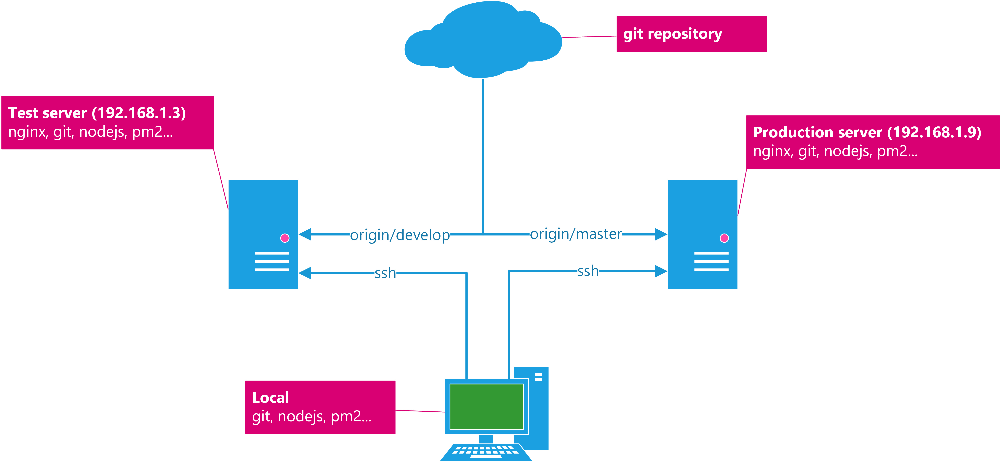

Trong tút này chúng ta sẽ thực hiện deploy nodejs app với sơ đồ như sau:


Đây là sơ đồ hệ thống deploy nodejs đơn giản nhất, tùy vào yêu cầu có thể sẽ phức tạp hơn như kết hợp CI để quá trình unit test và deploy diễn ra tự động.

__Mình giải thích sơ đồ này 1 chút:__

Khi thực hiện deploy thì máy __Local__ sẽ ssh vào 2 server __Test__ và __Production__.

Sau đó đọc file cấu hình deploy của pm2 (ecosystem.config.js) để thực hiện pull source code từ git repository theo branch tương ứng.

Cuối cùng là start các instance với source code đã pull.

### Thực hiện

- Đầu tiên phải đảm bảo rằng Local và các server đã thiết lập môi trường giống như sơ đồ (nginx, git, nodejs...phải đầy đủ đồ chơi nha).
- Thứ high là đảm bảo rằng server Test và Production đã được add SSH key của Local, nếu không khi deploy sẽ phải nhập tay password.
- Thứ bar là đảm bảo rằng tài khoản trên dịch vụ Git (GitHub, GitLab, Bitbucket...) của bạn đã được add SSH key của server Test và Production, nếu ko thì sẽ bị như bên trên.
- Cuối cùng là phải có 1 Nodejs app =)).

Sau khi pass các điều kiện trên thì bắt đầu thôi, config 1 chút trên server trước.

__Trên Test server:__

Run thần chú `sudo vi /etc/nginx/sites-available/default` để mở file config nginx và cập nhật lại như sau:
```bash
server {
    listen 80;

    server_name example.com;

    location / {
        proxy_pass http://localhost:3000;
        proxy_http_version 1.1;
        proxy_set_header Upgrade $http_upgrade;
        proxy_set_header Connection 'upgrade';
        proxy_set_header Host $host;
        proxy_cache_bypass $http_upgrade;
    }
}
```

Đọc file trên đủ hiểu vai trò của nginx rồi nhé, khi người dùng truy cập `192.168.1.3` với http port mặc định là 80 thì nginx sẽ reverse proxy thành `http://localhost:3000` (3000 chính là port mình start nodejs app)

__Trên Production server:__
Tương tự như trên Test server.

__Tại thư mục project trên Local:__

Run thần chú `pm2 ecosystem` để genarate ra file __ecosystem.config.js__

File này ban đầu sẽ có nội dung tương tự như sau:
```js
module.exports = {
  apps : [{
    name: 'API',
    script: 'app.js',

    // Options reference: https://pm2.keymetrics.io/docs/usage/application-declaration/
    args: 'one two',
    instances: 1,
    autorestart: true,
    watch: false,
    max_memory_restart: '1G',
    env: {
      NODE_ENV: 'development'
    },
    env_production: {
      NODE_ENV: 'production'
    }
  }],

  deploy : {
    production : {
      user : 'node',
      host : '212.83.163.1',
      ref  : 'origin/master',
      repo : 'git@github.com:repo.git',
      path : '/var/www/production',
      'post-deploy' : 'npm install && pm2 reload ecosystem.config.js --env production'
    }
  }
```
Mình cần thay đổi lại cho phù hợp với yêu cầu:
```js
module.exports = {
    apps: [{
        name: 'test-pm2',
        append_env_to_name: true,
        script: 'server.js',
        instances: 4,
        autorestart: true,
        max_memory_restart: '1G',
        env: { // common env variable
            NODE_ENV: 'development'
        },
        env_production: { // khi deploy với option --env production
            NODE_ENV: "production",
            PORT: 3000
        },
        env_development: { // khi deploy với option --env development
            NODE_ENV: "development",
            PORT: 3000
        },
    }],

    deploy: {
        production: {
            user: 'chungtran-prod', // user để ssh
            host: '192.168.1.9', // IP của server này (theo sơ đồ)
            ref: 'origin/master', // branch để pull source
            repo: 'git@github.com:chungtran4078/demo-pm2.git', // repo của project
            path: '/var/www/html/demo-pm2', // sẽ deploy vào thư mục này
            'post-deploy': 'yarn install && pm2 startOrRestart ecosystem.config.js --env production' // cmd để deploy
        },
        development: {
            user: 'chungtran-dev',
            host: '192.168.1.3',
            ref: 'origin/develop',
            repo: 'git@github.com:chungtran4078/demo-pm2.git',
            path: '/var/www/html/demo-pm2',
            'post-deploy': 'yarn install && pm2 startOrRestart ecosystem.config.js --env development'
        }

    }
};
```

Nội dung trên cũng khá dễ hiểu rồi, nếu chưa hiểu có thể xem document này nha: https://pm2.keymetrics.io/docs/usage/deployment/#complete-tutorial

Nhớ là phải push file này lên git cùng với source code nữa nha. Vì server sau khi pull về nó sẽ đọc file này để deploy.

Xong xuôi hết chưa?
Chạy lần lượt các cmd sau để deploy lên Test server:
```bash
pm2 deploy ecosystem.config.js development setup # setup ban đầu để chuẩn bị deploy như tạo thư mục, pull code...
pm2 deploy ecosystem.config.js development # tiến hành deploy
```

Tương tự với Production server luôn.

Truy cập `192.168.1.3` để xem app mà mình đã deploy từ branch develop và `192.168.1.9` để xem app mà mình đã deploy từ branch master.