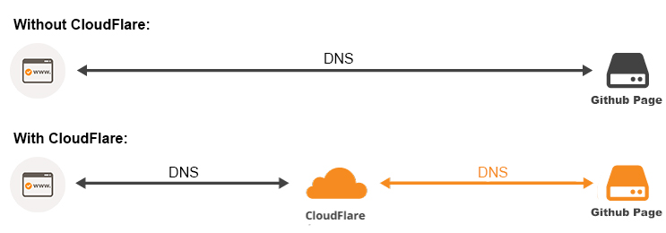
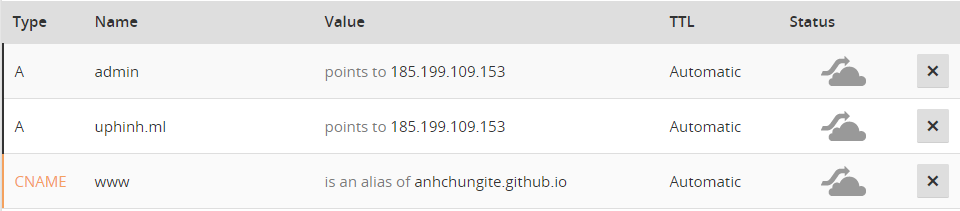
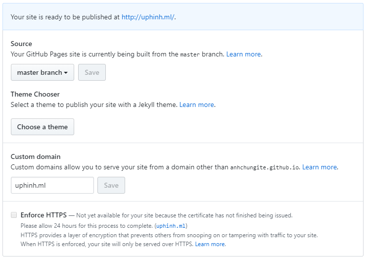
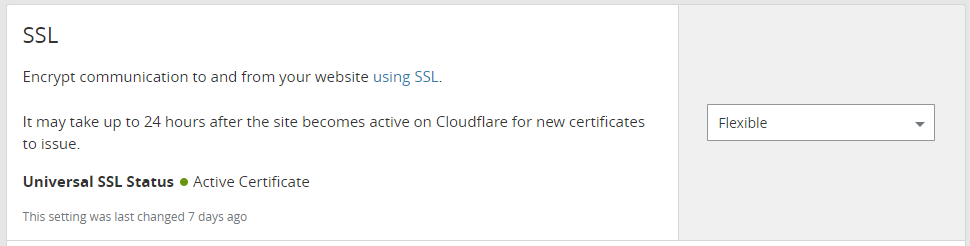
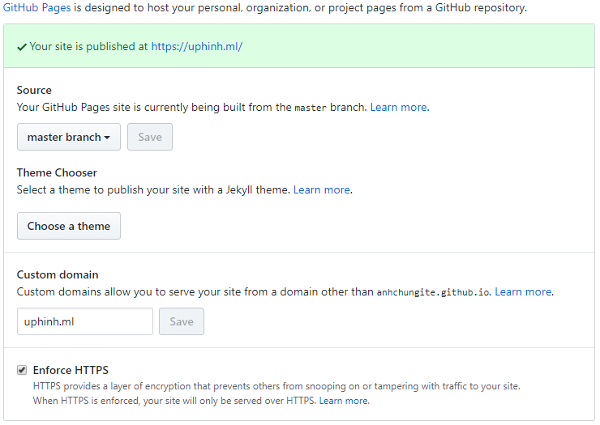

Cloudflare được biết đến là một dịch vụ DNS trung gian, giúp điều phối lưu lượng truy cập qua lớp bảo vệ CloudFlare. Các truy cập sẽ phải đi qua máy chủ của CloudFlare để xem dữ liệu website thay vì truy cập trực tiếp.

Các lợi ích của thằng này thì rất nhiều, từ nâng cao bảo mật cho đến tăng tốc website, ngay cả khi mình dùng gói free, các bạn có thể google thêm =)).

Vào nội dung chính, mời các bạn xem hình ảnh bên dưới:

Như đã nói thì Cloudflare là một DNS trung gian nên nó sẽ nằm ở giữa để chuyển tiếp yêu cầu tới GitHub Page.
Vậy thay vì trỏ domain trực tiếp đến Github Page, bây giờ đã sẽ trỏ về CloudFlare.

## DNS tên miền.
Đầu tiên phải có tên miền đã nhé, có thể vào Freenom đăng ký cho mình một cái domain chùa, mình cũng đăng ký sẵn một cái `uphinh.ml` (chấm mờ lờ đẳng cấp người chơi :D)

### Step 1: Trỏ tên miền về Cloudflare
Trỏ tên miền về Cloudflare rất đơn giản, chỉ cần thêm 2 Nameserver sau:
```
kami.ns.cloudflare.com
rick.ns.cloudflare.com
```

### Step 2: Trỏ tên miền về Github Page.
Sau khi tên miền đã được trỏ về CloudFlare thì việc tiếp theo là sử dụng CloudFlare để trỏ tiếp về Github Page.

Đăng nhập vào CloudFlare, chọn **Add website** và nhập tên miền của bạn vào. Qua tab **DNS** và thêm thông tin các bản ghi như sau:

**Lưu ý:** 

- Ở đây mình có 1 bản ghi `admin` đây là bản ghi cho việc dùng subdomain `admin.uphinh.ml`. Nếu không dùng subdomain thì không cần thêm vào.
- Mặc định CloudFlare sẽ điều phối truy cập đi qua proxy của họ, vì vậy các bản ghi được trỏ đến IP của Github Page sau khi đi qua proxy sẽ không phải là IP của Github Page nữa, vì vậy phải tắt sử dụng HTTP Proxy cho các bản ghi đi, chỉ dùng DNS. Bằng cách click vào biểu tượng đám mây màu vàng, lúc này nó sẽ chuyển thành màu xám như hình trên.

### Step 3: Thêm tên miền vào Github Page.


Vậy là mình có thể truy cập trang Github Page của mình thông qua tên miền `uphinh.ml` rồi.

## Thiết lập SSL
Sau khi Thêm tên miền vào Github Page thì các bạn để ý là không thể check vào tùy chọn **Enforce HTTPS** được. Lý do là domain của mình chưa được chứng thực SSL.

Quay trở lại CloudFlare, qua tab **Crypto**
Chọn `Flexible` và lý do mình sử dụng loại SSL này thì các bạn có thể xem [bài viết](https://thachpham.com/thu-thuat/su-dung-ssl-mien-phi-tu-cloudflare.html) của bác ThachPham.

Và CloudFlare họ có nói là "Phải chờ tối đa 24h cho việc phát hành chứng chỉ SSL", phải đợi thôi.

Sau khi đợi chờ chán chê và thời cơ đã chín muồi thì mình quay trở lại Github, và cái kết:


**Goodluck!**