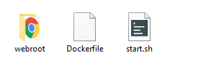
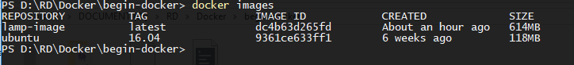
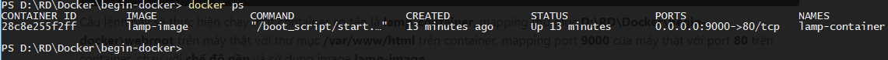

Như ở phần trước mình có giới thiệu qua về Dockerfile
>Dockerfile: là 1 file text, chứa các cấu hình của một image. Nếu bạn không muốn sử dụng các image có sẵn từ Docker hub thì bạn cũng có thể build cho riêng mình 1 image bằng Dockerfile. 


Trong bài viết này chúng ta sẽ viết 1 Dockerfile đơn giản để build ra 1 image chứa sẵn LAMP stack.

## Viết Dockerfile
Trong thư mục chứa project mình có các file/folder như sau:

- webroot (thư mục chứa source code)
- Dockerfile
- start.sh

Giờ sẽ lần lượt đi viết những file này.

### Dockerfile
```bash
FROM ubuntu:16.04

RUN DEBIAN_FRONTEND=noninteractive

RUN apt-get update

# Install apache
RUN apt-get install -y apache2

# Install php
RUN apt-get install -y php libapache2-mod-php php-mcrypt php-mysql
	
# Install mysql
RUN echo "mysql-server mysql-server/root_password password root" | debconf-set-selections \
    && echo "mysql-server mysql-server/root_password_again password root" | debconf-set-selections \
    && apt-get install -y mysql-server
	
WORKDIR /var/www/html

RUN mkdir /boot_script
COPY start.sh /boot_script
RUN chmod a+x /boot_script/*


ENTRYPOINT ["/boot_script/start.sh"]

EXPOSE 80
```
__* Giải thích:__
- __FROM__ image gốc, tức là 1 image chứa hệ điều hành, có thể là centos hoặc ubuntu. Ở trên là mình muốn container (máy ảo) của mình sẽ chạy ubuntu version 16.04. Nếu image `ubuntu:16.04` chưa được pull về (chưa có ở local) thì nó cũng sẽ tự động pull về từ Docker hub.
- __RUN__ thực thi các câu lệnh linux. Ở VD trên mình đã thực hiện cài đặt apache, php, mysql.

Chỗ này có đoạn `RUN DEBIAN_FRONTEND=noninteractive` có thể bạn sẽ thắc mắc, thì mục đích nó như sau:

Trong quá trình cài đặt apache và mysql thì hệ thống thường hỏi `yes/no` lúc này ta gõ `y` hoặc `yes` để bắt đầu cài đặt. Tuy nhiên ở Docker thì các câu lệnh này sẽ được chạy khi build image và để nó diễn ra tự động thì mình cần tắt chế độ tương tác bằng `RUN DEBIAN_FRONTEND=noninteractive`, sau đó thêm option `-y` (nghĩa là yes) ở cú pháp cài đặt apache và mysql. Như vậy trong quá trình cài đặt đến chỗ `yes/no` sẽ tự động trả lời là `yes`.
- __WORKDIR__ thư mục làm việc, khi truy cập vào container sẽ tự động cd đến thư mục này.
- __COPY__ sao chép 1 file/thư mục từ máy thật vào images, ở VD trên mình sao chép file `start.sh` và thư mục `/boot_script` của images.
- __ENTRYPOINT__ thiết lập các lệnh, tham số sẽ được thực thi khi container được chạy.
- __EXPOSE__ port mà container sẽ lắng nghe khi chạy. Ở đây mình dùng port 80 cho HTTP.

### start.sh
Đây là file được nhắc đến trong Dockerfile nãy giờ đây, thật ra nó cũng chỉ là vài câu lệnh linux thôi. Mục đích như mình đã nói ở __ENTRYPOINT__ là mình muốn nó chạy khi container chạy.
```bash
#!/bin/bash
usermod -d /var/lib/mysql/ mysql
chown -R mysql /var/lib/mysql/
service apache2 start
service mysql start
exec $@
```

Tiện thể mình giải thích luôn mục đích của mình với mấy câu lệnh trên là "Mình muốn khi container chạy thì đồng thời cũng khởi động apache và mysql"

## Thực hiện build image
Mở cmd tại thư mục project (thư mục mà chứa Dockerfile) và run lệnh sau:
```bash
docker build -t lamp-image .
```
- __lamp-image__ là tên do mình tự đặt cho image

Lúc này Docker sẽ thực hiện pull những image cần thiết và build image, quá trình này phụ thuộc vào tốc độ mạng. Sau khi build xong thử run `docker images` ta sẽ được như sau.



## Chạy container
Giờ đã có 1 image chứa LAMP rồi, mình có thể run bao nhiêu web server tùy ý, ở đây 1 webserver là 1 container.
```bash
docker run -d --name lamp-container -v D:\RD\Docker\begin-docker\webroot:/var/www/html -p 9000:80 -it lamp-image bash
```
Câu lệnh này sẽ thực hiện chạy một container có tên là __lamp-container__, mapping thư mục __D:\RD\Docker\begin-docker\webroot__ trên máy thật với thư mục __/var/www/html__ trên container, mapping port __9000__ của máy thật với port __80__ trên container, chạy với __chế độ nền__ và sử dụng image __lamp-image__.

Sau khi chạy, kiểm tra với lệnh `docker ps` ta có kết quả:



Vậy là ta đã có 1 container đang chạy, tiếp tục trong thư mục __webroot__ thử tạo file __index.php__ với nội dung:
```php
<?php
phpinfo();
?>
```
Vào trình duyệt truy cập __localhost:9000__ xem có gì nhé.

## Mở rộng 1 image
Nếu bạn để ý cú pháp Dockerfile thì sẽ phát hiện __FROM ubuntu:16.04__ thực chất là chúng ta đang mở rộng image __ubuntu:16.04__ bằng việc cài thêm apache, php, mysql.

Như vậy việc mở rộng 1 image dựa trên image đã có cũng thực hiện tương tự.
```bash
FROM lamp-image
RUN apt-get install -y vim
```

Build 1 image mới từ Dockerfile trên.
```bash
docker build -t lamp-vim-image .
```
Như bạn thấy image __lamp-image__ chưa được cài __vim__ ([một editor trong linux](/su-dung-vim-trong-linux/)) mình đã mở rộng image này bằng việc build 1 image mới tên là __lamp-vim-image__ được cài đặt __vim__.

Giờ thử chạy 1 container từ image vừa build xem đã sử dụng được __vim__ chưa nhé.
```bash
docker run --name lamp-vim-container -it lamp-vim-image bash
```