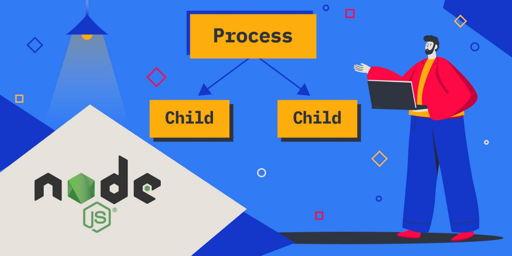

Như chúng ta đã biết Javascript trong Nodejs là single threading, tuy vậy khi cần xử lý nhiều việc trong cùng thời điểm thì Nodejs vẫn thực hiện tốt nhờ cơ chế non-blocking I/O cho phép các xử lý chạy bất đồng bộ mà không bị block lẫn nhau.

Tuy nhiên ở 1 cuộc chơi mà có các tác vụ ngốn CPU thì mọi chuyện lại khác. Trong khi Java, Golang … thể hiện được ưu điểm vượt trội do có hỗ trợ multi threading và tận dụng tối đa tài nguyên máy chủ thì Nodejs với single threading tỏ ra yếu thế, tất nhiên rồi, 1 tay sao so được với 3 đầu sáu tay.

Lấy ví dụ mình đang có bài toán:
Mình có 2 API, 1 cái sẽ trả về số fibonacci ứng với vị trí và người dùng gửi lên và 1 cái trả về "Hello world". Code sẽ đơn giản như sau:

__File: `server.js`__
```js
const express = require("express")
const app = express()

app.get("/greeting", (req, res) => {
  res.send("Hello world")
})

app.get("/get-fibonacci", (req, res) => {
    const startTime = new Date()
    const result = fibonacci(parseInt(req.query.number)) //parseInt is for converting string to number
    const endTime = new Date()
    res.json({
        number: parseInt(req.query.number),
        fibonacci: result,
        time: endTime.getTime() - startTime.getTime() + "ms",
    })
})

const fibonacci = n => {
  if (n <= 1) {
    return 1
  }

  return fibonacci(n - 1) + fibonacci(n - 2)
}

app.listen(3000, () => console.log("listening on port 3000"))
```
Thử chạy lần lượt `http://localhost:3000/get-fibonacci?number=45` và `http://localhost:3000/greeting`, ta sẽ thấy luồng chính đã sử dụng hết tài nguyên cho việc tính số fibonacci nên request `http://localhost:3000/greeting` sẽ ở trạng thái chờ cho đến khi số fibonacci được tính xong. Đấy là mới có 2 request thôi đấy, đối với server phục vụ hàng trăm req/s thì sao nhỉ, chả lẽ tất cả các request sẽ phải chờ cái ông tính fibonacci xong mới được xài tiếp ???

Hhmm...phải làm sao, phải làm sao! Đây là lúc chúng ta cần multi-threading, phải đưa các xử lý tốn CPU ra khỏi luồng chính.

__Nodejs cung cấp 3 giải pháp để giải quyết vấn đề trên:__
- Child processes
- Worker threads
- Cluster 

Chúng ta sẽ lần lượt sử dụng các giải pháp trên để giải quyết bài toán này xem chúng có ưu nhược điểm gì và nên dùng cái nào nhé.

## Sử dụng Child processes
Module child_process cung cấp khả năng tạo ra process được cấp phát bộ nhớ riêng. Giao tiếp giữa các process này được thiết lập thông qua IPC (inter-process communication) do hệ điều hành cung cấp.

Có 3 method chúng ta cần quan tâm khi làm việc với child_process:
- child_process.spawn()
- child_process.fork()
- child_process.exec()

### child_process.spawn()
Tạo ra 1 process bất đồng bộ, process này có thể chạy bất kỳ command nào mà bạn có thể chạy từ terminal, ví dụ: `pwd`, `ls`, `mkdir`, `python fibonacci.py 45`… Kết quả được trả về thông qua streams API.
### child_process.fork()
Tạo ra process con với process này là 1 module js, có thể giao tiếp giữa process cha và con thông qua method send (gửi) và on (nhận)
### child_process.exec()
Giống child_process.spawn() nhưng kết quả được trả về thông qua callback function

Như vậy, nhờ child_process ta có thể khởi tạo 1 process con với phần xử lý sử dụng ngôn ngữ khác chứ không nhất thiết phải là js. Tuy nhiên trong khuôn khổ bài viết này mình sẽ sử dụng js do vậy `child_process.fork()` là method mình sẽ dùng, các method khác có thể xem ở documentation của Nodejs:

__Tạo file xử lý main process: server.js__
Đây thực chất là file xử lý bình thường như khi chúng ta dùng single thread, ở đây mình đặt tên là `server.js` cho quen thuộc, không có gì magic ở đây cả. Chỗ nào magic mình sẽ comment giải thích.
```js
const express = require("express")
const app = express()
const { fork } = require("child_process")


app.get("/greeting", (req, res) => {
    res.send("Hello world")
})

app.get("/get-fibonacci", (req, res) => {
    const childProcess = fork("./child.js") // tham số đầu vào chính là path của file chứa code tính fibonaci 
    childProcess.send({ number: parseInt(req.query.number) }) // gửi data qua cho child process thông qua IPC
    
    const startTime = new Date()

    childProcess.on("message", message => {
        // nhận kết quả trả về sau khi child process xử lý xong
        const endTime = new Date()
        res.json({
            number: parseInt(req.query.number),
            fibonacci: message,
            time: endTime.getTime() - startTime.getTime() + "ms",
        })
    })
})

app.listen(3636, () => console.log("listening on port 3636"))
```

__Tạo file xử lý child process: child.js__
File cũng chỉ là file chứa hàm tính fibonacci thôi, không có gì đâu. Code ngắn gọn như sau:
```js
process.on("message", message => {
  // nhận data từ luồng chính gửi vào, ở đây là giá trị number
  const result = fibonacci(message.number)
  process.send(result)
  process.exit()
})

const fibonacci = n => {
  if (n <= 1) {
    return 1
  }

  return fibonacci(n - 1) + fibonacci(n - 2)
}
```

Thử chạy xem nào `http://localhost:3636/get-fibonacci?number=45` và `http://localhost:3636/greeting`. Mặc dù request tính fibonacci vẫn đang xử lý nhưng các request khác vẫn được hoàn thành ngay lập tức.

Như vậy khi có yêu cầu đi vào từ luồng chính thì nodejs sẽ tạo 1 child process để xử lý riêng tác vụ đó do đó các request tiếp theo vẫn được xử lý mà không phải chờ.


Tưởng tượng tàu Ever Given là một siêu tàu hàng dài hơn 400m, nặng hơn 220.000 tấn, tuy khổng lồ là vậy nhưng tàu lại được trang bị động cơ do tàu khựa sản xuất và hậu quả là nhiều lần đang đi vào kênh đào Suez nó đã bị chết máy dẫn đến các tàu phía sau cũng bị kẹt lại suốt nhiều ngày, mỗi lần như vậy gây thiệt hại hàng tỷ Biden khiến giới chức Ai Cập rất đau đầu.<br/>
Biết được thông tin đó, một anh chàng sinh năm 96 học BK cơ khí nhưng đã rẽ ngang sang IT đề nghị gặp giới chức Ai Cập để hiến kế.<br/>
Và ngay ngày hôm sau họ đã cho đào 1 nhánh kênh phụ rẽ ra từ nhánh chính để phục vụ riêng Ever Given, và từ bây giờ cứ mỗi lần nó đi vào kênh sẽ ngay lập tức được đưa qua nhánh phụ để lỡ nó có chết máy đi nữa thì không ảnh hưởng đến các tàu thuyền khác, giao thông trên kênh đào Suez từ đó diễn ra rất thuận lợi.

## FBI warning
Việc giao tiếp giữa các process chỉ có thể giữa process cha và con, các process con không thể giao tiếp với nhau.<br/>
Mỗi child process được phân bổ bộ nhớ độc lập do đó chi phí cho process là lớn hơn nhiều so với thread (1 đơn vị trong process). Có thể xem bài này để hiểu rõ hơn về Process và Thread: [Difference between Process and Thread](https://www.geeksforgeeks.org/difference-between-process-and-thread/)

__Ô kê bài sau chúng ta sẽ sử dụng Worker threads để giải quyết bài toán trên.__