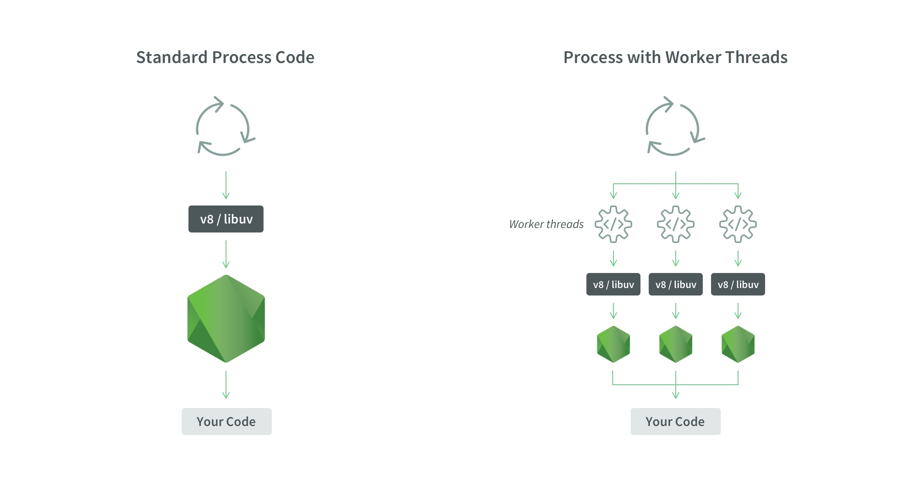

Module worker_threads được thêm vào Nodejs kể từ v10.5, Worker thread có thể được sử dụng để giải quyết các vấn đề của child processes vì thread nhẹ và các worker thread chia sẻ bộ nhớ hay cũng có thể giao tiếp với nhau. <br/>
Chúng ta cứ hiểu là sự khác biệt giữa __worker thread__ và __child processes__ cũng giống như sự khác biệt giữa __thread__ và __processes__ trong hệ thống máy tính vậy.

Quay trở lại bài toán từ phần 1, chúng ta sẽ triển khai worker threads để giải quyết nó.

__File: `server.js`__
```js
const express = require("express")
const app = express()
const { Worker } = require("worker_threads")

app.get("/greeting", (req, res) => {
  res.send("Hello world")
})

app.get("/get-fibonacci", async (req, res) => {
    const startTime = new Date()
    const result = await runGetFibonacciWorker(parseInt(req.query.number))
    const endTime = new Date()
    res.json({
        number: parseInt(req.query.number),
        fibonacci: result.fibonacci,
        time: endTime.getTime() - startTime.getTime() + "ms",
    })
})

function runGetFibonacciWorker(number) {
  return new Promise((resolve, reject) => {
    const worker = new Worker("./getFibonacciWorker.js", { workerData: { number } })
    worker.on("message", resolve)
    worker.on("error", reject)
    worker.on("exit", code => {
      if (code !== 0) {
        reject(new Error(`Worker stopped with exit code ${code}`))
      }
    })
  })
}

app.listen(3000, () => console.log("listening on port 3000"))
```
<br/>

__File: `getFibonacciWorker.js`__
```js
const { workerData, parentPort } = require("worker_threads")

const result = fibonacci(workerData);

// gửi lại kết quả cho parent
parentPort.postMessage({ fibonacci: result })

function fibonacci(n) {
  if (n <= 1) {
    return 1
  }

  return fibonacci(n - 1) + fibonacci(n - 2)
}
```

Chạy thử `http://localhost:3000/get-fibonacci?number=45` và `http://localhost:3000/greeting` thì ta thấy kết quả như mong đợi.


Ngoài ra có những bài toán ta có thể sử dụng nhiều worker để tăng tốc độ xử lý như xử lý hàng đợi, generate report... Mình sẽ làm 1 ví dụ đơn giản như sau:<br/>
Bài toán: Hãy tính tổng số chẵn từ 1 đến n, n là do người dùng gửi lên.

__File: `server.js`__
```js
const express = require("express")
const app = express()
const { Worker } = require("worker_threads")

app.get("/greeting", (req, res) => {
  res.send("Hello world")
})

app.get("/sum-even-number", async (req, res) => {
    const startTime = new Date()
    const result = await divisionOfWork(parseInt(req.query.number)) //parseInt is for converting string to number
    const sumAll = result.reduce((total, item) => {
      total += item.sum
      return total
    }, 0)
    const endTime = new Date()
    res.json({
        number: parseInt(req.query.number),
        sum: sumAll,
        time: endTime.getTime() - startTime.getTime() + "ms",
    })
})

function runSumEvenNumberWorker(data) {
  return new Promise((resolve, reject) => {
    const worker = new Worker("./sumEvenNumberWorker.js", { workerData: data})
    worker.on("message", resolve)
    worker.on("error", reject)
    worker.on("exit", code => {
      if (code !== 0) {
        reject(new Error(`Worker stopped with exit code ${code}`))
      }
    })
  })
}

function divisionOfWork(number) {
  // Giả sử ta sẽ có tôí đa 4 worker
  // Giờ ta chia number thành các phần bằng nhau để giao cho worker xử lý
  const oneOfPiece = parseInt(number / 4)
  let start = 0
  const workers = []
  while(start < number) {
    if (start + oneOfPiece > number) {
      const worker = runSumEvenNumberWorker({ start, end: number })
      workers.push(worker)
      break;
    }
    const worker = runSumEvenNumberWorker({ start, end: start + oneOfPiece })
    workers.push(worker)
    start += oneOfPiece + 1
  }
  return Promise.all(workers)
}

app.listen(3000, () => console.log("listening on port 3000"))
```

__File: `sumEvenNumberWorker.js`__
```js
const { workerData, parentPort } = require("worker_threads")

const result = sumEvenNumber(workerData.start, workerData.end);

// gửi lại kết quả cho parent
parentPort.postMessage({ sum: result })

function sumEvenNumber(start, end) {
  let total = 0
  for(let i = start; i <= end; i++) {
    if (i % 2 != 0) continue
    total += i
  }
  return total
}
```

Với mã trên mình đã thực hiện so sánh tốc độ khi sum số chẵn của 0 - 9999999999 thì nếu xử lý single thread sẽ mất khoảng ~64012ms, trong khi chạy sử dụng 4 worker sẽ chỉ mất khoảng ~17209ms. Rõ ràng rồi, 4 ông làm thì phải lẹ hơn 1 ông chứ hehe.

__Lưu ý:__ Đừng dùng dao giết trâu để mổ gà kẻo lại không biết khi nào có thịt gà mà ăn. Chẳng hạn bài toán sum số chẵn bên trên, nếu số bé quá thì ta sẽ thấy single thread chạy nhanh hơn nhiều với sử dụng worker vì nó không phải phân chia công việc và khởi tạo worker.<br/>

Hiểu đơn giản như sau:<br/>
Ông chủ thầu muốn bốc 10 bao xi măng xuống xe, trong thời gian ổng đi kiếm 4 tay bốc vác thì thằng lái xe nó nhảy xuống bốc xong và đi về ăn cơm từ đời nào rồi.

__Bài tiếp chúng ta sẽ tìm hiểu về Cluster và áp dụng cho bài toán trên xem nó có gì hay ho không nhé.__
