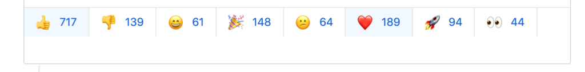

Tại thời điểm mình viết bài này thì thanh niên Evan You đã release `Vuejs v3.0.0-beta.1`. Một phiên bản Vue mới cóng, mà theo Evan You thì nó sẽ `Nhanh hơn, nhỏ hơn, dễ bảo trì hơn`.

Nghe có vẻ nó đang được cộng đồng Vue háo hức, hóng hớt, hăm he, hồi hộp, hào hứng...chờ ngày release chính thức nhỉ.

Nhưng không, Vue 3 tạo nên 1 cuộc tranh cãi dữ dội trên Hacker News, Reddit khi Evan You release RFC (Request for Comment) cho cách viết Component mới gọi là Function-based.

>Có thể bạn biết rồi: RFC là cách để nhà phát triển tham khảo ý kiến của cộng đồng. Khi họ muốn đưa ra một tính năng mới chẳng hạn, họ muốn bạn nói lên ý kiến ​​của mình về tính năng đó.

Và một số người đã bày tỏ sự phẫn nộ, văng tục, chửi thề không khác gì trẩu VN.

Vậy cái the hell gì đã khiến mọi người phản ứng dữ dội như vậy?

Mình sẽ dịch một bài viết rất hay của thanh niên Alex Kyriakidis: [Why people got upset with Vue 3](https://vueschool.io/articles/news/why-people-are-mad-with-vue-3/)


##<center>Tại sao mọi người khó chịu với Vue 3</center>
<center>- Alex Kyriakidis -</center>
<br/>
Thứ high, tôi thức dậy và thấy rất nhiều người đang tweet về một số tính năng mới của Vue 3. Tôi rất phấn khích và xem tweet này từ Evan You, ổng là người tạo ra Vue đó, trường hợp bạn không biết.

https://twitter.com/youyuxi/status/1142280533168119808

Ngày đen tối nhất của Vue? Nghe có vẻ như một bài viết hài hước. Tôi mở đường link và thật ngạc nhiên, tôi nhận ra đây không phải là trò đùa. Có vẻ như cộng đồng Vue thực sự tức giận với tính năng mới này. Mọi người trên Reddit và HackerNews nói Vue đã trở nên phức tạp, xấu xí, không thân thiện với developer.

"Act cool đứng hình mất 5 giây". Tôi đã tận hưởng ngày chủ nhật cuối tuần bằng việc không online và bây giờ tôi tối cmn cổ.
Vue đã trở nên phức tạp rồi ư? :worried:

Tôi chạy đến máy tính để đọc [Function-based Component API RFC](https://github.com/vuejs/rfcs/pull/42). Điều đầu tiên tôi chú ý là tỷ lệ lớn các phản ứng tích cực/tiêu cực, khoảng 5:1 tại thời điểm viết.



Nhưng điều đó không có ý nghĩa. __Đó không thể là một ngày đen tối__. 
Vue 3 thực sự đã có những thay đổi gì? Cái gọi là Function-based Component API mà rất nhiều người đang nói đến là cái gì?

Và khi nhìn vào đoạn code đầu tiên, tôi lại "Act cool đứng hình mất...1 phút".
```js
<template>
  <div>
    <span>count is {{ count }}</span>
    <span>plusOne is {{ plusOne }}</span>
    <button @click="increment">count++</button>
  </div>
</template>

<script>
  import { value, computed, watch, onMounted } from 'vue'

  export default {
    setup() {
      // reactive state
      const count = value(0)
      // computed state
      const plusOne = computed(() => count.value + 1)
      // method
      const increment = () => { count.value++ }
      // watch
      watch(() => count.value * 2, val => {
        console.log(`count * 2 is ${val}`)
      })
      // lifecycle
      onMounted(() => {
        console.log(`mounted`)
      })
      // expose bindings on render context
      return {
        count,
        plusOne,
        increment
      }
    }
  }
</script>
```

Gì? Cái quái gì thế? `data` được khai báo ở đâu? Tại sao `computed` lại là một function?

Trong khi vẫn còn sốc. Tôi đi rót đầy một tách cà phê.


Tôi quay trở lại máy tính và tiếp tục đọc [rendered version of the RFC](https://github.com/vuejs/rfcs/blob/function-apis/active-rfcs/0000-function-api.md) lần này. Vậy là mọi thứ đều được vứt vào function `setup` và tôi có thể viết bất cứ thứ gì (data, methods, lifecycle hooks,..vân vân mây mây) theo bất kỳ thứ tự nào, như viết một ứng dụng javascript thuần. Cách viết này trông có vẻ hơi lộn xộn nhưng linh hoạt một cách điên rồ. Tôi đi đến phần [ Comparison with 2.x API code examples](https://github.com/vuejs/rfcs/blob/function-apis/active-rfcs/0000-function-api.md#comparison-with-2x-api) ở dưới cùng của RFC để có thể thông não nhanh hơn.

###Fetching Data Based on Prop
####Standard API
```js
<template>
    <div>
        <template v-if="isLoading">Loading...</template>
        <template v-else>
            <h3>{{ post.title }}</h3>
            <p>{{ post.body }}</p>
        </template>
    </div>
</template>

<script>
    import { fetchPost } from './api'

    export default {
        props: {
            id: Number
        },
        data() {
            return {
                isLoading: true,
                post: null
            }
        },
        mounted() {
            this.fetchPost()
        },
        watch: {
            id: 'fetchPost'
        },
        methods: {
            async fetchPost() {
                this.isLoading = true
                this.post = await fetchPost(this.id)
                this.isLoading = false
            }
        }
    }
</script>
```

<br/>
<br/>

####Functions API

```js
<template>
    <div>
        <template v-if="isLoading">Loading...</template>
        <template v-else>
            <h3>{{ post.title }}</h3>
            <p>{{ post.body }}</p>
        </template>
        </div>
</template>

<script>
import { value, watch } from 'vue'
import { fetchPost } from './api'

export default {
    setup(props) {
        const isLoading = value(true)
        const post = value(null)

        watch(() => props.id, async (id) => {
            isLoading.value = true
            post.value = await fetchPost(id)
            isLoading.value = false
        })

        return {
            isLoading,
            post
        }
    }
}
</script>
```
Điều ngạc nhiên đầu tiên ở đây là độ dài của mã. Tôi rõ ràng mong đợi Function-based API sẽ có nhiều dòng hơn Object-based API truyền thống. Object-based 40 dòng so với Function-based 32 dòng. :ok_hand:

Cả hai ví dụ ở đây, thực hiện chức năng của một Component nhận `id` của post dưới dạng prop và request API để lấy data của post mỗi khi `id` thay đổi.

Tôi muốn khám phá method `setup` để thực sự biết điều gì đang xảy ra. Vậy là trong Function-based component API, method `setup` lấy `prop` làm đối số và `data` được xác định bằng function `value`, function `value` thì được import từ `vue`.

```js
import { value, watch } from 'vue'
import { fetchPost } from './api'

export default {
    setup(props) {
    const isLoading = value(true)
    const post = value(null)
        //....
    }
}
```

Sau đó, function `watch` lắng nghe những thay đổi trong `props.id` và nó thực hiện call AJAX mỗi khi `id` thay đổi.
```js
watch(() => props.id, async (id) => {
    isLoading.value = true
    post.value = await fetchPost(id)
    isLoading.value = false
})
```

Cuối cùng, `setup` trả về một object có các reactive state, giống như method `data`.
```js
export default {
    setup(props) {
        const isLoading = value(true)
        const post = value(null)

        watch(() => props.id, async (id) => {
            isLoading.value = true
            post.value = await fetchPost(id)
            isLoading.value = false
        })

        return {
            isLoading,
            post
        }
    }
}
```

Điều đó không tệ, phải không nào? Tôi tiếp tục đọc, để đến phần [Motivation](https://github.com/vuejs/rfcs/blob/function-apis/active-rfcs/0000-function-api.md#motivation). Đây là ví dụ tuyệt vời về việc chia Component thành các function.

```js
function useMouse() {
    const x = value(0)
    const y = value(0)
    const update = e => {
        x.value = e.pageX
        y.value = e.pageY
    }
    onMounted(() => {
        window.addEventListener('mousemove', update)
    })
    onUnmounted(() => {
        window.removeEventListener('mousemove', update)
    })
    return { x, y }
}

// in consuming component
const Component = {
    setup() {
        const { x, y } = useMouse()
        const { z } = useOtherLogic()
        return { x, y, z }
    },
    template: <div>{{ x }} {{ y }} {{ z }}</div>
}
```

Ôi chúa ơi! Tại thời điểm này, tôi nhận ra __Function-based Component API__ thật vi diệu. Vậy là sẽ không còn những Component với code dài lê thê.

Sự thật là các Component trong các ứng dụng lớn có thể trở nên thực sự điên rồ. Tôi đã làm việc với một số team trong các dự án lớn và tôi phải nói rằng độ dài Component với Object-based API là điều gây khó khăn cho nhiều người. Tôi đã thấy các "well-written components" lên tới 1000 dòng - không ai muốn cấu trúc lại nó. :see_no_evil:

Ngoài ra, Function-based API là __naturally type-friendly__ (chắc thanh niên muốn nói cách viết này thân thiện..mình đoán thế). Tôi biết __rất nhiều người dùng Typescript sẽ khóc những giọt nước mắt vui sướng__ khi nghe tin này.

###Human Thoughts
Nhóm Vue dành một lượng vô cùng lớn thời gian để duy trì và cải thiện framework và __thật buồn khi thấy cộng đồng tỏ ra khó chịu__, nhiều lần mà không thậm chí đọc đề xuất. Mọi người trên Reddit và HN đôi khi có thể bị nhiễm độc nhưng đừng để điều này làm sai lệch suy nghĩ của bạn trong khi bạn chưa được nắm rõ về vấn đề này.

__Nó giống như tin tức chúng ta nhận được từ internet và TV. Làm thế nào để xác minh tính chính xác của nó? Chúng ta phải làm nghiên cứu để tìm hiểu.__

Lời khuyên của tôi, chủ yếu là để duy trì sức khỏe tinh thần của bạn, là đón nhận những tin tức như thế theo cách tích cực vì không ai muốn làm cho phần mềm hoặc framework của họ trở nên tồi tệ hơn. __Nhóm Vue có thể dễ dàng gắn bó với Vue 2 API mãi mãi__ mà không cần phải nghiên cứu hàng ngày, phát triển các chiến lược mới, viết tài liệu mới, bala..bla... Điều đang xảy ra là vì lợi ích của riêng bạn, ngay cả khi điều đó không rõ ràng ngay từ cái nhìn đầu tiên.

Bạn thích cái nào hơn? Chấp nhận sử dụng một API mà nhóm tin rằng đang gặp những hạn chế và thấy các công ty tỷ đô tiếp theo như Facebook chọn một framework khác vì Vue không đủ linh hoạt cho họ?

###RFCs are for everyone
Vue.js là một dự án nguồn mở. Mọi người đều được chào đón và thực sự được khuyến khích tham gia thảo luận về các tính năng và thay đổi trong tương lai. Vì vậy, chúng tôi gọi những điều này là thảo luận RFCs - Request for Comments.

Tôi tò mò bạn nghĩ gì về Function-based Component API. Tôi đã sợ hãi khi lần đầu tiên nghe về nó nhưng càng đọc nó và chơi đùa với nó tôi càng thấy phấn khích. Nếu bạn thích nó, hãy đến [RFC](https://github.com/vuejs/rfcs/pull/42) và nhấn like cũng như cho nhóm và những người khác biết suy nghĩ của mình!

Nếu bạn không thích nó, không sao cả. Hãy đọc đề xuất và xem qua các bình luận một cách cẩn thận để xem những gì người khác nói và nếu có gì đó không rõ ràng, hãy để lại nhận xét với mối quan tâm của bạn. Nhóm Vue rất vui khi nhận được phản hồi và thảo luận với các nhà phát triển Vue.

###This is not Set in stone
>Đây là RFC (Request for Comments) - miễn là pull request này vẫn mở, đây chỉ là một đề xuất để lấy ý kiến ​​phản hồi. Chúng tôi khuyến khích bạn nói lên ý kiến ​​của mình, nhưng thực sự vui lòng đọc RFC chính thức trước khi bình luận, vì thông tin bạn nhận được từ một luồng Reddit / HN có thể không đầy đủ, lỗi thời hoặc hoàn toàn sai lệch.

__**This is not Set in stone__: Điều này có thể thay đổi. Ý tác giả muốn nói RFC chỉ là tham khảo, nó không phải là quyết định cuối cùng.

###Closing
Túm cái váy lại, Object-based API rất là "đáng yêu", do đó tôi dễ hiểu lý do tại sao rất nhiều người đã tức giận khi nghĩ phải thay đổi. Một điều đáng chú ý nữa là do nhiều người không đọc RFC đầy đủ hoặc đọc lướt qua các tiêu đề trên Reddit và những thông tin sai lệch, không rõ ràng đó khiến họ hét lên trên Twitter hoặc troll trên GitHub (Ta hay gọi là tay nhanh hơn não đó). __RFC tuyên bố rằng Object-based API sẽ vẫn ở đây, trên Vue 3__.

Tôi không thể chờ đợi Function-based API được hoàn thiện và phát hành và đưa tất cả vào hoạt động. Tôi chắc rằng tất cả các nhóm mà tôi đang tư vấn họ sẽ rất hào hứng khi có được siêu năng lực mới này trong tay. :rocket:

__Đừng ngạc nhiên bởi Vue 3!__ [Đăng ký Vue School](https://vueschool.io/) để trở thành người đầu tiên nhận được khóa học [Vue 3 chuyên sâu](https://vueschool.io/courses/the-vuejs-3-master-class) sắp tới của chúng tôi trên phiên bản mới nhất của Vue.js. Trong thời gian đó, nếu bạn đang tìm kiếm [Advanced Reusable Component Patterns](https://vueschool.io/courses/reusable-vuejs-component-patterns), hãy đảm bảo theo dõi [khóa học của chúng tôi](https://www.notion.so/vueschool/Vue-3-Function-based-Component-API-for-the-salvation-3078d1af3c674bb9a5837032110bc05e#9fe2fa6828854eeeb1273c6bdbb87b0b) để được thông báo khi nó được ra mắt.

##Ý kiến cá nhân

>Từ bỏ một thói quen đâu phải dễ dàng. -Khắc Việt -

Đúng vậy, khi đã quen thuộc với điều gì đó thì rất khó để chấp nhập từ bỏ...đấy là mình nói trong tình yêu thôi, chứ trong chuyện này của Vue bạn sẽ không phải từ bỏ cái gì cả. RFC đã tuyên bố __API mới tương thích 100% với cú pháp cũ, nó chỉ là tính năng thêm vào__.

Nhưng rõ ràng chúng ta thấy sự linh hoạt và API mới mang lại. Mình đã từng phải trừng mắt to ra rồi cuộn chuột lên xuống để tìm các state, method, computed... liên quan nhau khi maintainance những Vue Component có code dài dằng dặc. Với API mới, các code liên quan được group với nhau, Component xanh - sạch - đẹp hơn. Vậy ngại gì mà không thay đổi.

Cuối cùng, Evan You cùng team Vue đã và đang nỗ lực để Vue ngày càng tốt hơn, hãy luôn ủng hộ họ.